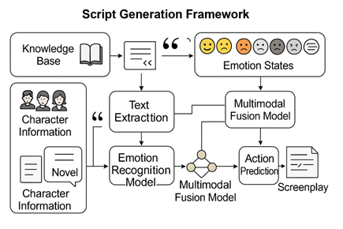

# 小说剧本转换器——基于LLM实现
笔者开发一种主要基于LLM（Deepseek API）的转换器（小说转剧本），辅助BERT情绪分析，Seq2Seq动作分析，以及历史背景获取，
成功开发一款很好的小说转剧本生成器；  
笔者与协助者从数据爬取，到模型转换生成，再到最后的剧本生成word，一体化流程。  

CSDN链接：https://blog.csdn.net/2301_77491330/article/details/147777317?fromshare=blogdetail&sharetype=blogdetail&sharerId=147777317&sharerefer=PC&sharesource=2301_77491330&sharefrom=from_link

<p align="center">
  
</p>

  
**本文的主要工作**
即便是不想了解本项目全部流程的人，笔者想也有可能有兴趣关注本项目，因为本项目包括了：
- 笔趣阁小说爬取 ———— 获取小说文本
- LLM调用实战 ———— 输出严格json数据
- Prompt工程 ———— LLM 轻松开发
- BERT 情绪分类任务 ———— 实现情绪捕捉
- Seq2Seq 动作生成任务 ———— 实现动作分析
- 结构化数据转剧本 ———— 格式控制
- 繁体字转换

综上，本项目虽然没能做到技术创新，但是实现了一个从0到1的剧本转小说项目(Novel-to-Script)，以此提供
给大家作为一些小小的参考。

  
**本文的项目结构**
```
├── code/                         # 项目主代码目录
│   ├── A_爬取数据集/             # 爬虫模块：用于从网页抓取小说数据
│   │   ├── 1_爬取小说类目.py      # 爬取各类小说分类及其链接
│   │   ├── 2_解析数据.py         # 解析小说章节数据获取小说
│   │   ├── 3_排序规整.py         # 对爬取的数据进行整理与排序
│   │   ├── config.py             # 请求头文件
│   │   └── novel_data/           # 存储爬取下来的小说数据
│   │   └── chromedriver-win64    # chromedriver文件夹
│
│   ├── B_小说解析/               # 小说文本解析模块
│   │   ├── 主模块-文本抽取.py     # 主要解析逻辑：抽取描述、对话等信息（基于 LLM 抽取任务）
│   │   ├── 辅助模块-情绪分析/     # 情绪识别模块（基于 BERT 多分类任务）
│   │   ├── 辅助模块-动作分析/     # 动作识别模块（基于 Seq2Seq 生成任务）
│   │   ├── 辅助模块-文本转对话/   # 文本转结构化剧本文本的转换模块（基于 LLM 融合任务）
│   │   ├── output/               # 输出最终结构化剧本结果
│   │   ├── mid_output/           # 中间结果存储
│   │   └── bert-base-chinese/    # 预训练模型-从 hugging face 下载
│
│   ├── C_剧本生成/               # 最终剧本构建与评估模块
│   │   ├── 剧本生成.py           # 将结构化数据转化为Word剧本
│   │   ├── 评估函数.py           # 使用API评估剧本质量
│   │   ├── 剧本输出.docx         # 生成的剧本文档
│   │   ├── 评估结果.csv          # 模型评估的结果数据
│   │   └── 对比剧本/             # 各版本生成剧本对比示例
│
│   └── U_工具库/                 # 工具函数与数据预处理
│       ├── 动作数据集生成.py     # 用于创建动作识别训练数据
│       ├── 繁体转简体.py         # 文本繁简转换工具
│       ├── 未处理数据/           # 原始未清洗的数据
│       └── 处理后数据/           # 处理完成的数据结果
│
├── charts/                      # 项目中引用的图示，如流程图等
│   └── 技术流程图.png
│
├── README.md                    # 项目说明文件，含背景、方法、运行方式等
```

  
**文本动作监督数据集** 

并且本文还提供一份上千条的小说动作分析数据集，及其生成代码，任何人都可以凭借此代码加上deepseek的API
去实现大量快速的动作分析的数据集制造。

| 类型     | 文本内容                                                                 | 动作描述         |
|----------|--------------------------------------------------------------------------|------------------|
| 言情     | 她轻轻地咬着下唇，眼中闪过一丝犹豫，最终还是踮起脚尖，闭上了眼睛。       | （期待地靠近）   |
| 历史     | 在古老的战场上，将军拔出长剑，指向远方的敌军阵营。                       | （拔剑指向远方） |
| 玄幻     | 她轻挥法杖，口中念出古老的咒语，周围的空气开始扭曲。                     | （施展魔法）     |
| 轻小说   | 她轻巧地跃上窗台，月光映照着她的背影。                                   | （轻盈跳跃）     |

  
**生成结果展示**
  
本文以 《凡人修仙传》前两章进行剧本的转换工作，因为笔者比较喜欢修仙类小说（doge），示例如下：
[点击查看剧本文档](code/C_剧本生成/剧本输出.docx)

  

**感谢支持** 

在项目的最后，笔者衷心感谢以下项目与开源资源的支持。正是因为互联网开放共享的精神，才使得本项目得以顺利完成，哪怕这只是一个聊作消遣的小工具，也深感受益良多：

- ChatGPT：提供代码生成与开发思路辅助；
- DeepSeek：提供高效且成本友好的国内可调用语言模型 API；
- bert-base-chinese：用于情绪识别等基础语言任务；
- Chinese_Multi-Emotion_Dialogue_Dataset：中文多情绪对话数据集（来源：Johnson8187/Chinese_Multi-Emotion_Dialogue_Dataset）；

此外，还要感谢所有为本项目提供灵感、工具或间接支持的开源项目与技术组织。正是这一切，共同构成了开发者学习与探索的土壤。

